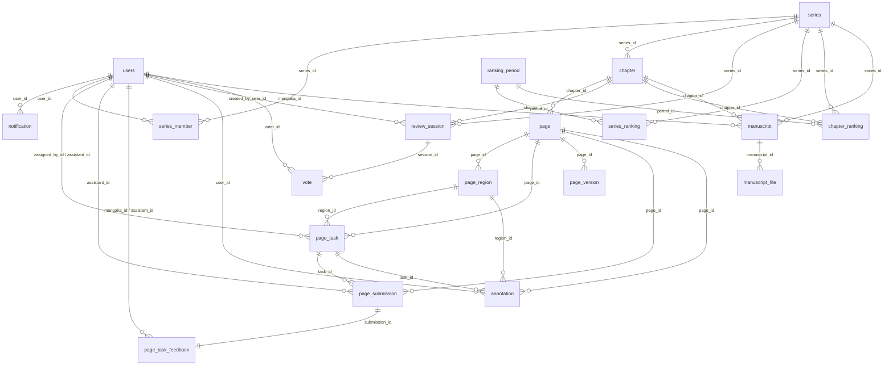
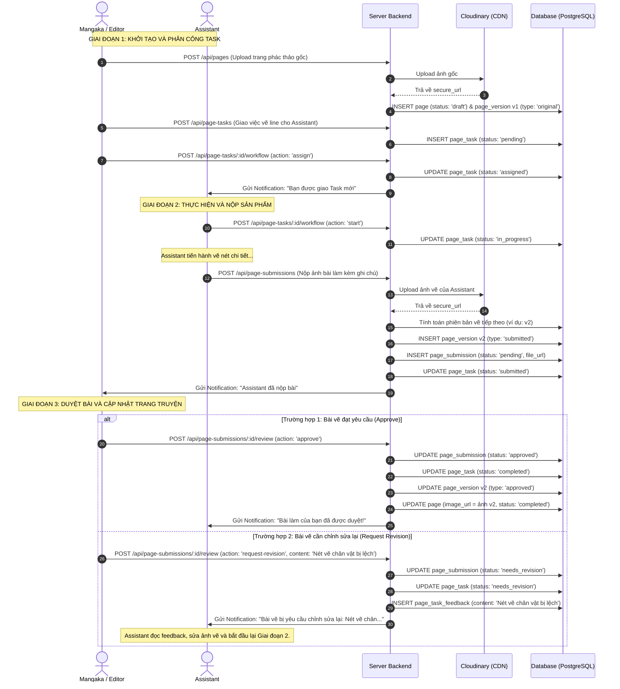

# Tài Liệu Đặc Tả Chi Tiết Hệ Thống Quản Lý Truyện Tranh (Manga Management System)

Tài liệu này cung cấp cái nhìn chi tiết và toàn diện về kiến trúc hệ thống, cơ cấu phân quyền (Roles), thiết kế cơ sở dữ liệu chi tiết (ERD), các quy tắc nghiệp vụ (Business Rules), và quy trình vận hành luồng công việc (Workflows) trong hệ thống Manga Management System. Mục tiêu của tài liệu này là giúp bất kỳ thành viên mới nào trong đội ngũ phát triển đều có thể nắm bắt và vận hành hệ thống một cách chuẩn xác.

---

## 1. Kiến Trúc Hệ Thống & Tổ Chức Mã Nguồn

Hệ thống được phát triển dưới dạng **REST API** sử dụng **Node.js** và framework **Express**, tích hợp dịch vụ cơ sở dữ liệu đám mây **Supabase (PostgreSQL)** và lưu trữ file phương tiện **Cloudinary**.

### 1.1. Luồng Xử Lý Yêu Cầu (Request-Response Flow)
Mỗi yêu cầu HTTP gửi đến server đều tuân thủ nghiêm ngặt quy trình phân lớp sau:

```
Client (Frontend)
   │
   ▼
1. Routes (Khai báo HTTP Method, Endpoint, gắn Middleware & Controller tương ứng)
   │
   ▼
2. Middleware (Xử lý Authentication - JWT, phân quyền Role, Upload file qua Multer)
   │
   ▼
3. Validation (Sử dụng thư viện Zod để validate tính hợp lệ của req.body, req.params, req.query)
   │
   ▼
4. Controller (Trích xuất dữ liệu thô từ request; chuyển giao cho Service xử lý; trả về Response qua helper)
   │
   ▼
5. Service (Chứa toàn bộ Business Logic, kiểm tra ràng buộc nghiệp vụ, FK và phân quyền logic)
   │
   ▼
6. Repository (Nơi duy nhất giao tiếp với Supabase client; thực hiện câu lệnh truy vấn dữ liệu SQL)
   │
   ▼
7. Supabase / PostgreSQL (Cơ sở dữ liệu lưu trữ vật lý)
   │
   ▼
8. Response Helper (Chuẩn hóa định dạng JSON phản hồi: success, message, data, pagination)
```

### 1.2. Cấu Trúc Thư Mục Một Module (`src/modules/`)
Mỗi tính năng hoặc thực thể được nhóm thành một thư mục module khép kín để dễ bảo trì:
*   `*.routes.js`: Định nghĩa các API endpoints và thứ tự chuỗi middleware bảo mật.
*   `*.validation.js`: Định nghĩa Zod schemas để lọc và validate dữ liệu đầu vào.
*   `*.controller.js`: Xử lý đầu vào/đầu ra HTTP, bắt lỗi bằng khối `try-catch` và chuyển tiếp lỗi qua `next(error)`.
*   `*.service.js`: Bộ não chứa các quy tắc nghiệp vụ của hệ thống (ví dụ: không cho phép đổi trạng thái task không hợp lệ).
*   `*.repository.js`: Thực hiện các câu lệnh thao tác dữ liệu qua Supabase.

---

## 2. Cơ Cấu Phân Quyền Chi Tiết (Role & Permission Matrix)

Hệ thống phân biệt rõ ràng 6 nhóm người dùng thông qua thuộc tính `role` trong bảng `users`. 

### 2.1. Phân Tích Chi Tiết Quyền Hạn
1.  **`admin` (Quản trị viên hệ thống)**:
    *   Toàn quyền CRUD (Create, Read, Update, Delete) trên mọi bảng.
    *   Quản lý tài khoản người dùng (kích hoạt, đình chỉ, khóa tài khoản).
    *   Cấu hình hệ thống và thiết lập các Giai đoạn xếp hạng (`ranking_period`).
2.  **`mangaka` (Tác giả chính)**:
    *   Tạo mới, chỉnh sửa thông tin Series truyện của mình.
    *   Tạo bản thảo (`manuscript`) và gửi lên hệ thống.
    *   Đăng ký danh sách trang (`page`) của từng Chapter.
    *   Tạo phân vùng tọa độ (`page_region`) và giao việc (`page_task`) cho trợ lý (`assistant`).
    *   Kiểm duyệt sản phẩm nộp từ trợ lý (`page_submission`): duyệt ảnh vẽ, gửi yêu cầu sửa đổi kèm feedback viết tay (`page_task_feedback`).
3.  **`assistant` (Trợ lý vẽ/dịch/edit)**:
    *   Xem danh sách các Task được phân công.
    *   Chuyển trạng thái Task sang đang làm (`in_progress`).
    *   Nộp kết quả công việc bằng cách tải ảnh lên hệ thống (`submitTask`), tự động sinh ra một `page_version` mới có trạng thái `submitted`.
    *   Đọc feedback và thực hiện vẽ lại các trang bị yêu cầu chỉnh sửa (`needs_revision`).
4.  **`editor` (Biên tập viên)**:
    *   Đóng vai trò điều phối viên. Hỗ trợ Mangaka quản lý và tạo Task vẽ.
    *   Xem và duyệt sơ bộ các bản thảo (`manuscript`) của Mangaka gửi lên.
    *   Khởi tạo, điều hành, tạm dừng hoặc đóng các Phiên đánh giá chất lượng (`review_session`) cho Series hoặc Chapter.
5.  **`reviewer` (Ban kiểm duyệt)**:
    *   Chỉ truy cập vào các Phiên đánh giá (`review_session`) đang hoạt động (`in_progress`).
    *   Gửi phiếu bầu (`vote`), đánh giá duyệt/từ chối, chấm điểm số (từ 1 - 10) và viết lời nhận xét chuyên môn.
6.  **`reader` (Độc giả)**:
    *   Truy cập ở chế độ Read-Only đối với các bộ truyện và chương có trạng thái là `published`.
    *   Không thể xem các thông tin nội bộ (Task, Submission, Feedback, Review Session, Manuscript).

---

## 3. Đặc Tả Chi Tiết Cơ Sở Dữ Liệu (Detailed ERD Schema)

Cơ sở dữ liệu được thiết kế theo mô hình quan hệ chặt chẽ nhằm đảm bảo tính toàn vẹn của dữ liệu trong quá trình sản xuất truyện.

### 3.1. Chi Tiết Các Thực Thể & Thuộc Tính

#### Bảng `users` (Quản lý người dùng)
*   **Mô tả**: Lưu trữ thông tin định danh và phân quyền của toàn bộ thành viên.
*   **Các cột**:
    *   `user_id` (UUID, PK): Định danh duy nhất toàn cầu.
    *   `username` (VARCHAR(100), Unique, Required): Tên đăng nhập.
    *   `email` (VARCHAR(255), Unique, Required): Email liên hệ và đăng nhập.
    *   `password` (TEXT, Required): Mật khẩu đã được mã hóa (bcrypt).
    *   `role` (VARCHAR(50), Required): Vai trò của người dùng (`admin`, `mangaka`, `assistant`, `editor`, `reviewer`, `reader`).
    *   `avatar_url` (TEXT, Optional): Đường dẫn ảnh đại diện của người dùng.
    *   `bio` (TEXT, Optional): Tiểu sử.
    *   `name` (VARCHAR(150), Optional): Tên thật hiển thị.
    *   `gender` (VARCHAR(20), Optional): Giới tính.
    *   `date_of_birth` (DATE, Optional): Ngày sinh nhật.
    *   `status` (VARCHAR(50), Default: `'active'`): Trạng thái hoạt động tài khoản (`active` - đang hoạt động, `suspended` - bị đình chỉ tạm thời, `banned` - bị khóa vĩnh viễn, `inactive` - chưa kích hoạt).

#### Bảng `series` (Quản lý bộ truyện)
*   **Mô tả**: Lưu trữ thông tin một tác phẩm truyện tranh lớn.
*   **Các cột**:
    *   `series_id` (UUID, PK): Khóa chính bộ truyện.
    *   `title` (VARCHAR(255), Required): Tên bộ truyện.
    *   `description` (TEXT, Optional): Tóm tắt nội dung cốt truyện.
    *   `cover_image_url` (TEXT, Optional): Đường dẫn ảnh bìa của bộ truyện.
    *   `genre` (VARCHAR(100), Optional): Thể loại truyện (ví dụ: Shonen, Action, Fantasy).
    *   `status` (VARCHAR(50), Default: `'draft'`): Trạng thái của bộ truyện trong quy trình duyệt:
        *   `draft`: Bản nháp, chỉ Mangaka và Editor thấy.
        *   `pending_review`: Chờ ban kiểm duyệt đánh giá.
        *   `approved`: Đã được ban kiểm duyệt thông qua.
        *   `rejected`: Bị từ chối xuất bản.
        *   `published`: Đã xuất bản rộng rãi cho Reader đọc.
        *   `archived`: Được lưu trữ/đóng lại.
        *   `hidden`: Bị ẩn đi do vấn đề bản quyền hoặc chỉnh sửa.
        *   `banned`: Bị cấm hiển thị.
        *   `deleted`: Đã xóa logic.

#### Bảng `series_member` (Thành viên dự án truyện)
*   **Mô tả**: Phân bổ nhân sự tham gia vào quy trình sản xuất của từng bộ truyện cụ thể.
*   **Các cột**:
    *   `series_member_id` (UUID, PK)
    *   `series_id` (UUID, FK -> `series.series_id`): Cascade Delete khi bộ truyện bị xóa.
    *   `user_id` (UUID, FK -> `users.user_id`): Cascade Delete khi người dùng bị xóa.
    *   `role_in_series` (VARCHAR(50), Required): Vai trò cụ thể trong nhóm làm truyện (ví dụ: Lead Artist, Translator, Typesetter, Colorist).
*   **Ràng buộc**: `UNIQUE (series_id, user_id)` để đảm bảo một người không bị trùng lặp vị trí thành viên trong cùng một bộ truyện.

#### Bảng `chapter` (Quản lý chương truyện)
*   **Mô tả**: Các tập/chương truyện nhỏ thuộc một Series.
*   **Các cột**:
    *   `chapter_id` (UUID, PK)
    *   `series_id` (UUID, FK -> `series.series_id`): Tham chiếu trực tiếp đến Series cha.
    *   `chapter_number` (INT, Required): Số thứ tự của tập (ví dụ: Tập 1, Tập 2).
    *   `title` (VARCHAR(255), Optional): Tên chương truyện.
    *   `thumbnail_image_url` (TEXT, Optional): Ảnh đại diện của chương truyện.
    *   `status` (VARCHAR(50), Default: `'draft'`): Các trạng thái tương tự bảng `series`.
    *   `view_count` (INT, Default: `0`): Lượt đọc chương.
    *   `publish_date` (TIMESTAMP, Optional): Thời gian chương truyện được đặt lịch hoặc chính thức phát hành.
*   **Ràng buộc**: `UNIQUE (series_id, chapter_number)` đảm bảo không có hai chương truyện trùng số thứ tự trong cùng một Series.

#### Bảng `page` (Trang vẽ chi tiết)
*   **Mô tả**: Quản lý từng trang hình ảnh đơn lẻ nằm trong một chương truyện.
*   **Các cột**:
    *   `page_id` (UUID, PK)
    *   `chapter_id` (UUID, FK -> `chapter.chapter_id`): Chương chứa trang truyện này.
    *   `page_number` (INT, Required): Số thứ tự trang trong chương (ví dụ: Trang 1, Trang 2).
    *   `image_url` (TEXT, Optional): Đường dẫn hình ảnh trang truyện đã hoàn thiện và được phê duyệt để độc giả xem.
    *   `status` (VARCHAR(50), Default: `'draft'`): Trạng thái sản xuất trang:
        *   `draft`: Trang nháp ban đầu.
        *   `in_progress`: Đang trong quy trình vẽ/thiết kế bởi trợ lý.
        *   `review`: Trợ lý nộp bài và đang chờ duyệt.
        *   `completed`: Đã vẽ xong và được phê duyệt hoàn thành.
        *   `published`: Đã xuất bản cùng chương truyện.
*   **Ràng buộc**: `UNIQUE (chapter_id, page_number)`.

#### Bảng `page_region` (Phân khu vực trên trang vẽ)
*   **Mô tả**: Khoanh vùng tọa độ hình chữ nhật trên ảnh trang vẽ để giao việc hoặc viết ghi chú trực quan.
*   **Các cột**:
    *   `region_id` (UUID, PK)
    *   `page_id` (UUID, FK -> `page.page_id`): Trang chứa phân vùng này.
    *   `x`, `y` (INT, Required): Tọa độ góc trên bên trái của phân vùng (pixel hoặc tỷ lệ phần trăm).
    *   `width`, `height` (INT, Required): Chiều rộng và chiều cao của phân vùng cần khoanh.

#### Bảng `page_task` (Nhiệm vụ vẽ)
*   **Mô tả**: Nhiệm vụ cụ thể giao cho Assistant vẽ hoặc xử lý trên trang.
*   **Các cột**:
    *   `task_id` (UUID, PK)
    *   `page_id` (UUID, FK -> `page.page_id`): Trang cần thực hiện công việc.
    *   `assigned_by_id` (UUID, FK -> `users.user_id`): Người giao việc (Mangaka hoặc Editor).
    *   `region_id` (UUID, FK -> `page_region.region_id`, Optional): Nếu task chỉ tập trung vào một góc nhỏ (Region), trường này sẽ lưu khóa ngoại của vùng đó.
    *   `assistant_id` (UUID, FK -> `users.user_id`): Trợ lý chịu trách nhiệm thực hiện task này.
    *   `task_type` (VARCHAR(100), Required): Loại nhiệm vụ (ví dụ: `'Lineart'`, `'Coloring'`, `'Background'`, `'Translation'`, `'Typesetting'`).
    *   `status` (VARCHAR(50), Default: `'pending'`): Trạng thái của Task trong vòng đời sản xuất:
        *   `pending`: Đang chờ phân bổ/chưa bắt đầu.
        *   `assigned`: Đã giao cho trợ lý nhưng họ chưa bắt đầu làm.
        *   `in_progress`: Trợ lý đang thực hiện.
        *   `submitted`: Trợ lý đã hoàn thành và nộp bài.
        *   `review`: Đang chờ tác giả chính đánh giá.
        *   `approved`: Đã được duyệt.
        *   `needs_revision`: Bị yêu cầu sửa lại do không đạt yêu cầu.
        *   `completed`: Công việc đã kết thúc thành công.
        *   `on_hold`: Tạm dừng công việc.
        *   `cancelled`: Đã hủy bỏ nhiệm vụ.
        *   `rejected`: Bài nộp bị bác bỏ hoàn toàn.
    *   `deadline` (TIMESTAMP, Optional): Thời hạn nộp bài.
    *   `content` (TEXT, Optional): Mô tả chi tiết yêu cầu công việc.

#### Bảng `page_version` (Lịch sử các phiên bản ảnh trang vẽ)
*   **Mô tả**: Lưu trữ lịch sử hình ảnh của trang qua các lần thay đổi để tránh mất mát dữ liệu vẽ.
*   **Các cột**:
    *   `version_id` (UUID, PK)
    *   `page_id` (UUID, FK -> `page.page_id`)
    *   `image_url` (TEXT, Required): URL hình ảnh trên Cloudinary của phiên bản này.
    *   `version_number` (INT, Required): Số phiên bản tự động tăng (1, 2, 3...).
    *   `version_type` (VARCHAR(50), Default: `'submitted'`): Loại phiên bản (`original` - ảnh phác thảo gốc ban đầu của Mangaka, `submitted` - ảnh do trợ lý nộp lên, `approved` - ảnh cuối cùng đã được duyệt làm ảnh trang chính thức).
*   **Ràng buộc**: `UNIQUE (page_id, version_number)`.

#### Bảng `page_submission` (Bản ghi nộp bài)
*   **Mô tả**: Ghi nhận chi tiết mỗi lần Assistant nộp ảnh lên cho một Task vẽ cụ thể.
*   **Các cột**:
    *   `submission_id` (UUID, PK)
    *   `page_id` (UUID, FK -> `page.page_id`)
    *   `task_id` (UUID, FK -> `page_task.task_id`)
    *   `assistant_id` (UUID, FK -> `users.user_id`)
    *   `file_url` (TEXT, Required): Đường dẫn file vẽ trợ lý nộp lên.
    *   `version_number` (INT, Required): Liên kết logic tương ứng với số phiên bản trong `page_version`.
    *   `submission_status` (VARCHAR(50), Default: `'pending'`): Trạng thái bài nộp (`pending`, `approved`, `rejected`, `needs_revision`).
    *   `submission_notes` (TEXT, Optional): Trợ lý có thể viết chú thích khi nộp bài.
    *   `submitted_at` (TIMESTAMP, Default: `now()`)
    *   `reviewed_at` (TIMESTAMP, Optional): Thời điểm người giao việc thực hiện duyệt/từ chối bài nộp này.

#### Bảng `page_task_feedback` (Phản hồi sửa đổi)
*   **Mô tả**: Lưu thông tin ý kiến đánh giá chi tiết của Mangaka/Editor khi yêu cầu Trợ lý sửa đổi bài nộp.
*   **Các cột**:
    *   `feedback_id` (UUID, PK)
    *   `submission_id` (UUID, FK -> `page_submission.submission_id`): Feedback được gắn cụ thể vào một lần nộp bài không đạt.
    *   `mangaka_id` (UUID, FK -> `users.user_id`, Optional): Người viết feedback.
    *   `assistant_id` (UUID, FK -> `users.user_id`, Optional): Trợ lý nhận feedback.
    *   `content` (TEXT, Required): Nội dung góp ý chi tiết (ví dụ: *"Tô màu tóc sáng hơn một chút", "Nét vẽ chỗ này bị lem"*).

#### Bảng `annotation` (Ghi chú trực quan)
*   **Mô tả**: Ghi chú tự do gắn vào một điểm tọa độ (x, y) trên trang để trao đổi nhanh giữa các thành viên.
*   **Các cột**:
    *   `annotation_id` (UUID, PK)
    *   `page_id` (UUID, FK -> `page.page_id`)
    *   `user_id` (UUID, FK -> `users.user_id`): Người viết ghi chú.
    *   `region_id` (UUID, FK -> `page_region.region_id`, Optional)
    *   `task_id` (UUID, FK -> `page_task.task_id`, Optional)
    *   `x`, `y` (INT, Optional): Tọa độ điểm ghi chú.
    *   `content` (TEXT, Optional): Nội dung ghi chú.
    *   `status` (VARCHAR(50), Default: `'active'`): Trạng thái ghi chú (`active` - đang hiển thị, `resolved` - đã giải quyết xong, `closed` - đóng ghi chú, `archived` - đưa vào lưu trữ).

#### Bảng `review_session` (Phiên bình chọn kiểm duyệt)
*   **Mô tả**: Tổ chức các cuộc họp bỏ phiếu duyệt chất lượng truyện trước khi xuất bản.
*   **Các cột**:
    *   `session_id` (UUID, PK)
    *   `series_id` (UUID, FK -> `series.series_id`): Bộ truyện cần kiểm duyệt.
    *   `chapter_id` (UUID, FK -> `chapter.chapter_id`, Optional): Chương truyện cần kiểm duyệt (nếu kiểm duyệt cụ thể chương).
    *   `created_by_user_id` (UUID, FK -> `users.user_id`): Biên tập viên tạo phiên.
    *   `name` (VARCHAR(255), Optional): Tên phiên kiểm duyệt.
    *   `description` (TEXT, Optional): Mô tả mục tiêu/nội dung phiên kiểm duyệt.
    *   `status` (VARCHAR(50), Default: `'pending'`): Trạng thái phiên:
        *   `pending`: Đang chuẩn bị.
        *   `in_progress`: Đang mở bình chọn cho Reviewers bỏ phiếu.
        *   `completed`: Đã dừng nhận phiếu vote, tiến hành tổng hợp.
        *   `finished`: Đã kết thúc hoàn tất phiên.
        *   `paused`: Tạm ngưng phiên kiểm duyệt.
        *   `cancelled`: Đã hủy phiên.
    *   `started_at`, `ended_at` (TIMESTAMP, Optional): Thời gian bắt đầu và kết thúc thực tế.

#### Bảng `vote` (Phiếu bầu)
*   **Mô tả**: Lưu kết quả bỏ phiếu của Reviewer cho một `review_session`.
*   **Các cột**:
    *   `vote_id` (UUID, PK)
    *   `voter_id` (UUID, FK -> `users.user_id`): Người chấm điểm (Phải có role `reviewer`).
    *   `session_id` (UUID, FK -> `review_session.session_id`): Thuộc phiên đánh giá nào.
    *   `decision` (VARCHAR(50), Optional): Quyết định phê duyệt (ví dụ: `'Approved'`, `'Rejected'`).
    *   `score` (INT, Optional): Điểm số đánh giá chất lượng truyện (Ràng buộc giá trị từ 1 đến 10).
    *   `note` (TEXT, Optional): Nhận xét cụ thể của Reviewer.
    *   `status` (VARCHAR(50), Default: `'submitted'`): Trạng thái phiếu (`submitted` - đã nộp, `verified` - đã được xác minh).

#### Bảng `manuscript` (Bản thảo ý tưởng)
*   **Mô tả**: Ghi nhận toàn bộ bản thảo kịch bản chữ hoặc phác họa đen trắng do tác giả đề xuất.
*   **Các cột**:
    *   `manuscript_id` (UUID, PK)
    *   `mangaka_id` (UUID, FK -> `users.user_id`): Tác giả soạn thảo bản thảo.
    *   `series_id` (UUID, FK -> `series.series_id`): Gắn với bộ truyện nào.
    *   `chapter_id` (UUID, FK -> `chapter.chapter_id`, Optional): Nếu bản thảo dành cho một chương cụ thể.
    *   `title` (VARCHAR(255), Optional): Tên bản thảo.
    *   `content` (TEXT, Optional): Nội dung chữ của bản thảo (nếu có).
    *   `file_url` (TEXT, Optional): URL file tài liệu đính kèm (Word, PDF...).
    *   `status` (VARCHAR(50), Default: `'draft'`): Trạng thái duyệt bản thảo (`draft`, `submitted`, `in_review`, `needs_revision`, `approved`, `published`, `archived`, `hidden`, `rejected`, `deleted`).

#### Bảng `manuscript_file` (Tệp đính kèm bản thảo)
*   **Các cột**: `file_id` (UUID, PK), `manuscript_id` (UUID, FK -> `manuscript.manuscript_id`), `file_url`, `file_type`, `file_name`, `description`, `uploaded_at`, `status` (Default: `'uploaded'`, giá trị khác: `'validated'`, `'deleted'`).

---

### 3.2. Sơ đồ Thực thể Quan hệ chi tiết (Entity Relationship Diagram)



---

## 4. Đặc Tả Quy Tắc Nghiệp Vụ Của Hệ Thống (Business Rules)

Để tránh dữ liệu rác và đảm bảo vận hành chính xác, Backend triển khai các quy tắc nghiệp vụ nghiêm ngặt trong tầng **Service**:

### 4.1. Quy Tắc Khi Tạo Chương (Chapters)
*   **Kiểm tra tính tồn tại**: Trước khi tạo Chapter, hệ thống bắt buộc kiểm tra xem `series_id` có tồn tại trong cơ sở dữ liệu hay không.
*   **Trùng số chương**: Không cho phép tạo trùng số chương (`chapter_number`) trong cùng một `series_id`. Ví dụ: Series "One Piece" không thể có hai Chapter số 1.
*   **Quy tắc Xuất bản (Publishing Constraint)**: Không cho phép chuyển trạng thái của Chapter sang `published` nếu Series cha của nó vẫn đang ở trạng thái nháp (`draft`), bị ẩn (`hidden`) hoặc bị cấm (`banned`).

### 4.2. Quy Tắc Giao Việc (Page Tasks)
*   **Kiểm tra Phân vùng (Region Validating)**: Nếu nhiệm vụ vẽ chỉ định một vùng cụ thể (`region_id`), hệ thống bắt buộc kiểm tra xem phân vùng đó có thực sự thuộc về trang vẽ (`page_id`) tương ứng hay không.
*   **Xác minh Trợ lý (Assistant Validating)**: Khi gán `assistant_id` cho Task, hệ thống phải xác thực người được gán có tồn tại và thuộc tính `role` của người dùng đó bắt buộc phải là `'assistant'`.

### 4.3. Quy Tắc Phiên Bản Trang Vẽ (Page Versioning)
*   **Phiên bản đầu tiên**: Khi tác giả chính tạo mới một Page trống hoặc ảnh thô, hệ thống tự động chèn bản ghi `page_version` đầu tiên với `version_number = 1`, `version_type = 'original'`.
*   **Không tin tưởng số phiên bản từ Client**: Khi nộp bài vẽ, Client không được tự gửi lên số phiên bản. Service của Backend sẽ gọi hàm `pageVersionsRepo.getNextVersionNumber(pageId)` để thực hiện truy vấn `MAX(version_number) + 1` của trang đó để đảm bảo tính tuần tự và tránh lỗi xung đột đồng thời (Race Condition).
*   **Đồng bộ ảnh chính thức**: Khi một `page_submission` được duyệt (`approved`), hệ thống sẽ:
    1.  Cập nhật trạng thái `page_version` tương ứng sang `'approved'`.
    2.  Ghi đè URL ảnh của phiên bản được duyệt này vào cột `image_url` của bảng chính `page`.
    3.  Chuyển trạng thái của trang vẽ `page.status` sang `'completed'`.

### 4.4. Quy Tắc Kiểm Duyệt Và Đánh Giá (Review & Voting)
*   **Đúng chương và bộ truyện**: Khi tạo `review_session` gắn với một `chapter_id`, hệ thống phải xác minh chương truyện đó thực sự thuộc bộ truyện (`series_id`) đã khai báo trong session.
*   **Chỉ vote khi phiên đang mở**: Chỉ cho phép Reviewer tạo bản ghi `vote` hoặc sửa đổi phiếu bầu nếu trạng thái của phiên đánh giá đó đang là `in_progress`. Hệ thống sẽ chặn toàn bộ phiếu bầu nếu session ở trạng thái `pending`, `completed`, `finished` hoặc `cancelled`.
*   **Ràng buộc điểm số**: Cột `score` trong bảng `vote` chỉ chấp nhận các giá trị số nguyên trong đoạn `[1, 10]`.

---

## 5. Đặc Tả Luồng Công Việc Chi Tiết (Detailed Workflows)

Hệ thống điều khiển quy trình sản xuất truyện thông qua các máy trạng thái (State Machines) được quản lý chặt chẽ trong mã code:

### 5.1. Quy Trình Duyệt Bản Thảo (Manuscript State Machine)

```
[draft] (Tác giả viết/phác thảo nháp)
   │
   ▼ (Tác giả gọi API: manuscriptWorkflow 'submit')
[submitted] (Chờ biên tập viên đánh giá)
   │
   ├─► (Biên tập viên từ chối thẳng) ───────────────────────► [rejected]
   │
   ▼ (Biên tập viên bắt đầu xem: action 'start-review')
[in_review] (Biên tập viên đang phân tích)
   │
   ├─► (Yêu cầu tác giả sửa lại: action 'request-revision') ──► [needs_revision]
   │                                                               │ (Tác giả sửa xong & submit lại)
   │                                                               └─► quay lại [submitted]
   │
   ├─► (Từ chối bản thảo: action 'reject') ────────────────► [rejected]
   │
   ▼ (Thông qua bản thảo: action 'approve')
[approved] (Bản thảo đã được duyệt)
   │
   ├─► (Lưu trữ bản thảo: action 'archive') ───────────────► [archived]
   │
   ▼ (Biến thành chương chính thức: action 'publish')
[published] (Chương truyện chính thức lên sóng độc giả)
   │
   ├─► (Tạm ẩn: action 'hide') ────────────────────────────► [hidden]
   │
   ▼ (Đưa vào kho lưu trữ: action 'archive')
[archived]
```

### 5.2. Quy Trình Vẽ & Phê Duyệt Trang Vẽ (Page Task & Submission Details)

Đây là quy trình chi tiết thể hiện sự tương tác giữa tác giả chính (Mangaka) và Trợ lý (Assistant) để hoàn thành từng trang truyện vẽ:



---

## 6. Tổng Kết Cho Lập Trình Viên Phát Triển Hệ Thống

Để đảm bảo hệ thống vận hành đúng chuẩn thiết kế Database-First và quy tắc nghiệp vụ:
1.  **Luôn kiểm tra khóa ngoại bằng code trước**: Hãy đảm bảo kiểm tra thực thể liên quan có tồn tại không trước khi lưu bản ghi mới xuống Supabase để tránh lỗi khó hiểu từ cơ sở dữ liệu.
2.  **Sử dụng trạng thái chuẩn**: Tuyệt đối sử dụng các trạng thái đã khai báo trong danh sách constants tại [DATABASE_SCHEMA.md](file:///d:/SEM8-FPTu/SWP392/project/Manga-Management-System-Backend/DATABASE_SCHEMA.md#L445-L533).
3.  **Lịch sử chỉnh sửa**: Mọi lần Assistant nộp bài đều phải tăng giá trị `version_number` của trang đó lên 1 đơn vị, không ghi đè trực tiếp lên phiên bản cũ nhằm mục đích bảo vệ tiến trình vẽ của nhóm.
