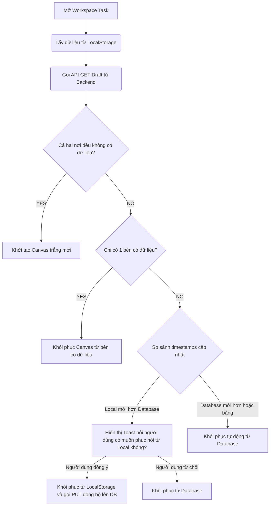

# Hướng Dẫn Tích Hợp Frontend: Auto-Save Draft Workflow

Tài liệu này hướng dẫn cách lập trình phía Frontend (Client) để tích hợp với module `page_task_draft` trên Backend. Cơ chế này giúp tự động lưu trạng thái làm việc (Workspace) của trợ lý (Assistant) vẽ Canvas mà không làm nghẽn hệ thống.

---

## 1. Danh Sách API Draft

### 1.1 Lấy Bản Nháp Hiện Tại (Get Draft)
* **API Goal**: Lấy dữ liệu Canvas đã lưu gần nhất của Assistant cho một Page Task cụ thể để khôi phục trạng thái làm việc.
* **Method**: `GET`
* **Endpoint**: `/api/page-tasks/:taskId/draft`
* **Role**: `Assistant` (Người được phân công task này)
* **Headers**: `Authorization: Bearer <token>`
* **Request Params**:
  * `taskId` (UUID) - ID của task đang vẽ.
* **Response**:
  * **Trường hợp đã có bản nháp trước đó (HTTP 200)**:
    ```json
    {
      "success": true,
      "statusCode": 200,
      "message": "Success",
      "data": {
        "draftId": "a1b2c3d4-e5f6-4a7b-8c9d-0e1f2a3b4c5d",
        "taskId": "11111111-1111-4111-8111-111111111111",
        "imageUrl": "https://res.cloudinary.com/.../preview.png",
        "canvasState": {
          "version": "1.0",
          "layers": [
            { "id": "layer1", "visible": true, "elements": [...] }
          ]
        }
      }
    }
    ```
  * **Trường hợp chưa có bản nháp nào (HTTP 200 - data: null)**:
    ```json
    {
      "success": true,
      "statusCode": 200,
      "message": "Success",
      "data": null
    }
    ```

---

### 1.2 Lưu Tự Động Bản Nháp (Auto Save - Upsert)
* **API Goal**: Định kỳ đẩy dữ liệu Canvas mới nhất lên Cloud Database (UPSERT - Nếu chưa có thì Insert, có rồi thì tự động đè/Update).
* **Method**: `PUT`
* **Endpoint**: `/api/page-tasks/:taskId/draft`
* **Role**: `Assistant`
* **Headers**: `Authorization: Bearer <token>`
* **Request Body**:
  ```json
  {
    "imageUrl": "https://res.cloudinary.com/.../preview_temp.png",
    "canvasState": {
      "version": "1.0",
      "layers": [...]
    }
  }
  ```
  *(imageUrl là ảnh thumbnail xuất dạng base64/blob được upload lên Cloudinary tạm thời để hiển thị danh sách preview ngoài dashboard nếu cần. CanvasState là cục JSON chứa vector, nét vẽ, layer)*
* **Response (HTTP 200)**:
  ```json
  {
    "success": true,
    "statusCode": 200,
    "message": "Draft saved successfully.",
    "data": {
      "draftId": "a1b2c3d4-e5f6-4a7b-8c9d-0e1f2a3b4c5d",
      "taskId": "11111111-1111-4111-8111-111111111111",
      "imageUrl": "https://...",
      "canvasState": { ... }
    }
  }
  ```

---

### 1.3 Xóa Bản Nháp (Delete Draft)
* **API Goal**: Xóa bản nháp vẽ Canvas của Assistant cho Page Task này khi người dùng yêu cầu hoặc sau khi tác vụ hoàn thành (nếu muốn).
* **Method**: `DELETE`
* **Endpoint**: `/api/page-tasks/:taskId/draft`
* **Role**: `Assistant`
* **Headers**: `Authorization: Bearer <token>`
* **Response (HTTP 200)**:
  ```json
  {
    "success": true,
    "statusCode": 200,
    "message": "Draft deleted successfully.",
    "data": null
  }
  ```

---

## 2. Chiến Lược Lưu Trữ Phía Frontend (Storage Strategy)

Để đảm bảo hiệu năng và tính sẵn sàng (offline-first), Frontend nên kết hợp **Local Storage (trên trình duyệt)** và **Database (thông qua Backend API)** theo chiến lược sau:

```
[Mọi thao tác chuột/nét vẽ]
        │
        ▼ (Tần suất rất cao - Realtime)
 ┌──────────────┐
 │ LocalStorage │  -> Lưu ngay lập tức (Debounce 500ms) để chống mất điện/mất mạng đột ngột.
 └──────┬───────┘
        │
        ▼ (Tần suất trung bình - Định kỳ 5 ~ 10 giây hoặc sự kiện quan trọng)
 ┌──────────────┐
 │ Database API │  -> Gửi PUT request lên server để đồng bộ và khôi phục khi đổi thiết bị.
 └──────────────┘
```

### 2.1 Local Storage (Tốc độ cao, không phụ thuộc mạng)
* **Khóa lưu trữ**: Sử dụng format `draft_${taskId}_${userId}` để phân biệt bản nháp của từng người và từng task trên máy.
* **Thời điểm lưu**:
  * Lưu trạng thái Canvas vào Local Storage sau mỗi nét vẽ (Sử dụng kỹ thuật **Debounce** khoảng `500ms` để tránh ghi đĩa liên tục gây lag UI).
  * Ghi kèm trường `clientUpdatedAt: Date.now()` để phục vụ việc so sánh đồng bộ sau này.

### 2.2 Database Sync (Đồng bộ hóa đám mây, đa thiết bị)
* **Tần suất**:
  * Định kỳ mỗi **5 đến 10 giây** (sử dụng `setInterval` hoặc cơ chế xếp hàng đợi - Queue).
  * Chỉ gọi API `PUT` khi Canvas thực sự có thay đổi so với lần đồng bộ trước (sử dụng biến flag `isDirty` hoặc so sánh mã hóa JSON string).
  * Không đồng bộ lên database sau mỗi nét vẽ đơn lẻ (sẽ gây quá tải HTTP Request).

---

## 3. Quy Trình Khởi Động & Khôi Phục Bản Nháp (Restore Workflow)

Khi Assistant mở giao diện Workspace để vẽ một Task:



### 3.1 Code logic ví dụ lúc Khởi động (React / Vue / Vanilla JS)
```javascript
async function initWorkspace(taskId, userId) {
  const localKey = `draft_${taskId}_${userId}`;
  const localDraft = JSON.parse(localStorage.getItem(localKey));
  
  let dbDraft = null;
  try {
    const response = await fetch(`/api/page-tasks/${taskId}/draft`, {
      headers: { 'Authorization': `Bearer ${token}` }
    });
    const result = await response.json();
    dbDraft = result.data; // Có thể null hoặc Object
  } catch (error) {
    console.warn("Không thể kết nối Backend để lấy nháp đám mây. Sẽ dùng Offline LocalDraft.");
  }

  // 1. Cả 2 đều rỗng -> Tạo mới
  if (!localDraft && !dbDraft) {
    return initNewCanvas();
  }

  // 2. Chỉ có ở Local
  if (localDraft && !dbDraft) {
    restoreCanvas(localDraft.canvasState);
    return;
  }

  // 3. Chỉ có ở DB
  if (!localDraft && dbDraft) {
    restoreCanvas(dbDraft.canvasState);
    // Lưu lại local bản vừa tải từ DB về để làm mốc đồng bộ
    localStorage.setItem(localKey, JSON.stringify({
      canvasState: dbDraft.canvasState,
      clientUpdatedAt: Date.now()
    }));
    return;
  }

  // 4. Có ở cả 2 nơi -> So sánh thời gian cập nhật
  // Giả sử localDraft lưu cấu trúc: { canvasState, clientUpdatedAt }
  const localTime = localDraft.clientUpdatedAt || 0;
  // Dựa vào DB updated_at trả về từ server
  const dbTime = new Date(dbDraft.updatedAt || dbDraft.created_at).getTime();

  if (localTime > dbTime + 2000) { // Local mới hơn đáng kể (> 2 giây)
    const confirmRestore = confirm("Chúng tôi tìm thấy bản vẽ nháp mới hơn chưa lưu trên thiết bị này. Bạn có muốn phục hồi nó?");
    if (confirmRestore) {
      restoreCanvas(localDraft.canvasState);
      // Gọi đồng bộ ngược lên Server ngay
      syncToDatabase(taskId, localDraft.canvasState);
    } else {
      restoreCanvas(dbDraft.canvasState);
    }
  } else {
    restoreCanvas(dbDraft.canvasState);
  }
}
```

---

## 4. Xử Lý Khi Mất Kết Nối Mạng (Offline Mode)

1. **Khi rớt mạng**:
   * Canvas vẫn tiếp tục cho vẽ bình thường.
   * Lưu liên tục các nét vẽ vào Local Storage.
   * UI hiển thị biểu tượng trạng thái đám mây màu xám kèm thông báo: *"Đã lưu tạm trên máy (Offline)"*.
   * Flag trạng thái đồng bộ: `isSynced = false`.
2. **Khi có mạng lại**:
   * Frontend lắng nghe sự kiện mạng: `window.addEventListener('online', syncOfflineDraft);`.
   * Khi bắt được tín hiệu online, lập tức đọc Local Storage và gọi API `PUT /api/page-tasks/:taskId/draft` để đẩy dữ liệu lên Database.
   * Cập nhật UI đám mây màu xanh: *"Đã đồng bộ Cloud"*.

---

## 5. Dọn Dẹp Bản Nháp (Cleanup)

Theo khuyến nghị từ **Business Rules** tại [DATABASE_SCHEMA.md](file:///d:/SEM8-FPTu/SWP392/project/Manga-Management-System-Backend/DATABASE_SCHEMA.md):
* **Khi Assistant bấm "Submit Task"**:
  * **KHÔNG NÊN xóa bản nháp ngay lập tức**.
  * Giữ bản nháp lại phòng trường hợp Mangaka / Editor đánh giá **"Needs Revision"** (Yêu cầu sửa lại). Lúc đó Assistant mở lại Task sẽ có sẵn các layers cũ để chỉnh sửa tiếp tục thay vì phải vẽ lại từ đầu.
* **Thời điểm xóa bản nháp thực sự**:
  * Khi Assistant chủ động bấm nút **"Xóa bản vẽ/Reset Canvas"** -> Gọi `DELETE /api/page-tasks/:taskId/draft` đồng thời xóa Local Storage.
  * Khi Task được chuyển trạng thái sang **Completed** (Đã duyệt thông qua, kết thúc tác vụ) -> Hệ thống tự động xóa ở client hoặc cronjob dọn dẹp cũ.
